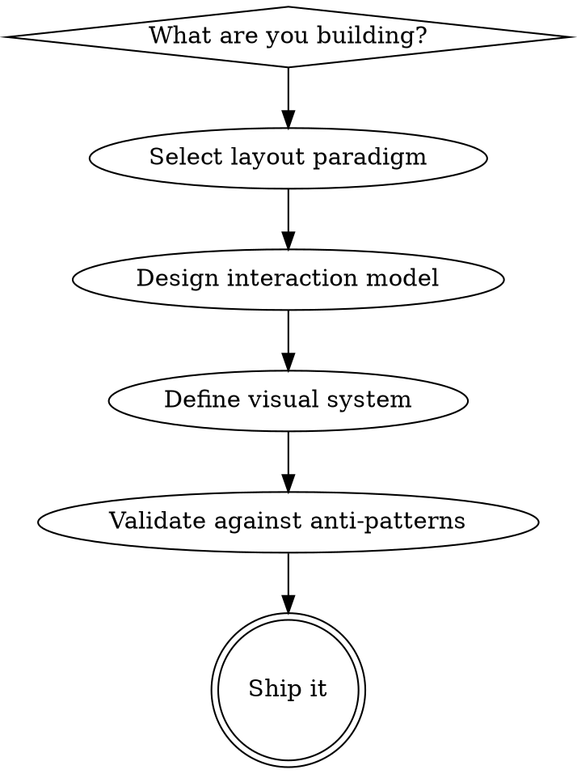

# TUI Design System

Universal design patterns for building exceptional terminal user interfaces. Framework-agnostic — works with Ratatui, Ink, Textual, Bubbletea, or any TUI toolkit.

> For editing **this repo's** terminal UI (`apps/pythinker-code/src/tui`), use the **write-tui** skill instead. This skill is the cross-project design vocabulary.

**Core philosophy:** TUIs earn their power through spatial consistency, keyboard fluency, and information density that respects human attention. Design for the expert's speed without abandoning the beginner's discoverability.

## Design process



1. Pick a **layout paradigm** from what you're building.
2. Design the **interaction model** (navigation, keybindings, help, dialogs).
3. Define the **visual system** (color tiers, semantic slots, hierarchy).
4. Add **data visualization** and **motion** where they earn their place.
5. **Validate** against the anti-patterns checklist, then ship.

---

## 1. Layout paradigm selector

| App type | Paradigm | Examples |
|---|---|---|
| File manager | Miller Columns | yazi, ranger |
| Git / DevOps tool | Persistent Multi-Panel | lazygit, lazydocker |
| System monitor | Widget Dashboard | btop, bottom, oxker |
| Data browser / K8s | Drill-Down Stack | k9s, diskonaut |
| SQL / HTTP client | IDE Three-Panel | harlequin, posting |
| Shell augmentation | Overlay / Popup | atuin, fzf |
| Log / event viewer | Header + Scrollable List | htop, tig |

### Persistent Multi-Panel
All panels visible simultaneously; focus shifts between them. Users build spatial memory — "branches are always bottom-left."

```
┌─ Status ──┬─────────── Detail ──────────┐
├─ Files ───┤                             │
│ > file.rs │  diff content here...       │
│   main.rs │                             │
├─ Branches ┤                             │
│ * main    │                             │
│   feat/x  │                             │
└───────────┴─────────────────────────────┘
  [q]uit [c]ommit [p]ush [?]help
```
**Use for:** multi-faceted tools needing simultaneous context (git clients, container managers, monitoring).
**Key rule:** panels keep fixed positions across sessions. Never rearrange without user action.

### Miller Columns
Three-pane past/present/future navigation: parent (left), current (center), preview (right).

```
┌── Parent ──┬── Current ──┬── Preview ────────┐
│   ..       │ > config/   │ port: 8080        │
│   src/     │   lib/      │ host: localhost   │
│ > config/  │   main.rs   │ log_level: debug  │
│   tests/   │   mod.rs    │ db_url: postgres  │
└────────────┴─────────────┴───────────────────┘
```
**Use for:** navigating hierarchical data where context above and below matters.
**Key rule:** selecting in the center shifts everything left; the preview always reflects the highlighted item.

### Drill-Down Stack
One level at a time; navigation pushes/pops levels like a stack. Breadcrumb shows depth.

```
 Context > namespace: prod > pods
┌─────────────────────────────────────────────┐
│ NAME              READY   STATUS    AGE       │
│ > api-7f9c        2/2     Running   3d        │
│   worker-1a2b     1/1     Running   3d        │
└─────────────────────────────────────────────┘
 :pods  :deploy  :svc        [Enter] drill [Esc] up
```
**Use for:** deep hierarchies where showing all levels at once is impractical (Kubernetes, DB schemas).
**Key rule:** always show the navigation path as a breadcrumb. Provide a `:resource` command mode for direct jumps.

### Widget Dashboard
Self-contained widget panels with independent data. All info visible at once; no navigation required.

```
┌─── CPU ──────────────┬─── Memory ──────────┐
│ ▁▂▃▅▇█▇▅▃▂▁▂▃▅▇      │ ████████░░ 78%       │
│ core0: 45% core1: 67%│ 12.4G / 16.0G        │
├─── Network ──────────┼─── Disk ─────────────┤
│ ▲ 1.2 MB/s ▼ 340KB/s │ /: 67%  /home: 45%   │
├─── Processes ────────┴──────────────────────┤
│ PID   USER  CPU%  MEM%  CMD                  │
│ 1234  root  23.4  4.5   postgres             │
└──────────────────────────────────────────────┘
```
**Use for:** monitoring, real-time status, dashboards.
**Key rule:** each widget is self-contained with its own title. Use braille/block characters for density.

### IDE Three-Panel
Sidebar (left), editor/main (center), detail/output (bottom). Tab bar along top.
**Use for:** editing-focused tools (SQL clients, HTTP tools, config editors).
**Key rule:** sidebar toggles with a single key. Center supports tabs. Bottom panel can expand to full height.

### Overlay / Popup
TUI appears on demand over the shell, disappears after use.
**Use for:** shell augmentations (history search, file picker, command palette).
**Key rule:** configurable height; return the selection to the caller; never disrupt scrollback.

### Header + Scrollable List
Fixed header with meters/stats, scrollable data below, function bar at bottom.
**Use for:** single-purpose viewers of one stream (process lists, logs, commit history).
**Key rule:** header and footer stay pinned; only the middle scrolls.

---

## 2. Responsive layout

Terminals resize constantly. Pick a degradation strategy and test it.

| Strategy | Behavior |
|---|---|
| Priority collapse | Less important panels hide first below minimum width |
| Stacking | Panels collapse to title-only bars; the active one expands (zellij pattern) |
| Breakpoint modes | Switch layout entirely below a threshold (multi-panel → single panel) |
| Minimum size gate | Show "terminal too small" below a usable minimum |

**Rules:**
- Define a minimum size (typically **80×24**). Below it, show a resize message.
- Never crash on resize. Handle SIGWINCH gracefully.
- Use constraint-based layouts (percentages, min/max, ratios) — not absolute positions.
- Test at **80×24, 120×40, 200×60**.

---

## 3. Interaction model

### Navigation style by complexity

| App complexity | Recommended model |
|---|---|
| Single-purpose, <20 actions | Direct keybinding (every key = action) |
| Multi-view, complex | Vim-style modes + contextual footer |
| IDE-like, many features | Command palette + tabs + vim motions |
| Data browser | Drill-down + fuzzy search + `:` command mode |

### Keyboard design layers

| Layer | Keys | Audience | Always shown? |
|---|---|---|---|
| L0 Universal | arrows, Enter, Esc, q | Everyone | Yes (footer) |
| L1 Vim motions | `hjkl / ? : gg G` | Intermediate | Yes (footer) |
| L2 Actions | single mnemonics: `d`elete, `c`ommit, `p`ush | Regular | On `?` help |
| L3 Power | composed commands, macros, custom bindings | Power | Docs only |

**Lingua franca (don't deviate):** `j/k` down/up · `h/l` left/right or collapse/expand · `/` search · `?` help · `:` command mode · `q` quit (or Esc back one level) · `Enter` select/confirm/drill · `Tab` switch focus · `Space` toggle selection · `g/G` top/bottom.

**Never bind:** `Ctrl+C` (interrupt), `Ctrl+Z` (suspend), `Ctrl+\` (quit). They belong to the terminal.

### Focus management
- Only one widget receives input at a time. `Tab`/`Shift+Tab` cycle focus.
- Focus indicator: highlighted border, color change, or cursor presence. Unfocused panels are dimmed or use thinner borders.
- Modal dialogs are focus traps — the background receives no events.
- Nested focus: the outer container routes events to the focused child.

### Search & filtering
Universal pattern: press `/`, type, results filter live.
- `n/N` next/previous match · `Esc` dismiss.
- Fuzzy by default; `'` prefix for exact. Highlight matched characters. Preview updates for the highlighted result.

### Help — three tiers

| Tier | Trigger | Content | Audience |
|---|---|---|---|
| Always visible | Footer bar | 3–5 essential shortcuts | Everyone |
| On demand | `?` | Full keybindings for current context | Regular |
| Documentation | `--help` / man page | Complete reference | Power |

Footer format: `[q]uit [/]search [?]help [Tab]focus [Enter]select`. Make it context-sensitive — show only what's actionable right now.

### Dialogs & confirmation

| Severity | Pattern |
|---|---|
| Reversible | Just do it; brief status-bar confirmation |
| Moderate (delete file) | Inline "Press y to confirm" |
| Severe (drop database) | Modal requiring the resource name typed in |
| Irreversible batch | `--dry-run` flag + explicit confirmation |

Modals render over a dimmed background. Toasts auto-dismiss in 3–5s. Status-bar messages are vim-style one-liners that auto-fade.

---

## 4. Color design system

### Terminal color tiers — design for graceful degradation

| Tier | Sequence | Colors | Strategy |
|---|---|---|---|
| 16 ANSI | `\033[31m` | 16 (relative) | Foundation; terminal theme controls appearance |
| 256 | `\033[38;5;{n}m` | 256 | Extended; fixed colors may clash with themes |
| True color | `\033[38;2;{r};{g};{b}m` | 16.7M (absolute) | Full control; needs `COLORTERM=truecolor` |

**Detection order:** `COLORTERM=truecolor|24bit` → true color · `TERM` contains `256color` → 256 · `NO_COLOR` set → no color · else 16 ANSI.

**Golden rule:** the TUI must be usable in 16-color mode. True color *enhances* — it never *creates* the hierarchy.

### Semantic color slots — name by function, not appearance

| Slot | Purpose | Typical dark |
|---|---|---|
| `fg.default` | Body text | `#c0caf5` |
| `fg.muted` | Secondary / metadata | `#565f89` |
| `fg.emphasis` | Headers, focused | `#e0e0e0` |
| `bg.base` | Primary background | `#1a1b26` |
| `bg.surface` | Panel/widget bg | `#24283b` |
| `bg.overlay` | Popup/dialog bg | `#414868` |
| `bg.selection` | Selected highlight | `#364a82` |
| `accent.primary` | Interactive / focus | `#7aa2f7` |
| `accent.secondary` | Supporting | `#bb9af7` |
| `status.error` | Errors / deletions | `#f7768e` |
| `status.warning` | Caution | `#e0af68` |
| `status.success` | Success / additions | `#9ece6a` |
| `status.info` | Informational | `#7dcfff` |

**Never hardcode hex in widget code. Always reference a semantic slot.**

### Visual hierarchy techniques

| Technique | Effect | Use for |
|---|---|---|
| Bold (SGR 1) | More weight | Headers, labels, active items |
| Dim (SGR 2) | Less weight | Metadata, timestamps |
| Italic (SGR 3) | Distinction | Comments, types |
| Underline (SGR 4) | Actionable | Links, URLs |
| Reverse (SGR 7) | Swap fg/bg | Selection (always works!) |
| Strikethrough (SGR 9) | Negation | Deleted/deprecated |

**Recipe:** 80% of content in `fg.default`. Headers `bold + fg.emphasis`. Metadata `dim + fg.muted`. Status in semantic colors. Accents for interactive elements only.

### Background layering
Create depth without borders by stepping lightness: `bg.base` → `bg.surface` → `bg.overlay`, each ~5–8% lighter in dark themes. The contrast gradient reads as depth and reduces the need for box-drawing.

### Theme architecture & accessibility
- Base16 pattern: 8 monotones (background↔foreground gradient) + 8 accents. Ship a dark theme by default, at least one light variant, and respect `NO_COLOR`.
- **WCAG AA:** 4.5:1 for body text, 3:1 for large text / UI elements.
- **Never use color alone** — pair with symbols (✓ ✗ ▲), text, position, or typography.
- Color-blind-safe pairs: blue+orange, blue+yellow, black+white. Avoid red vs green as the only signal.
- Test: monochrome mode, a color-blindness simulator, 3+ terminal emulators, light and dark.

---

## 5. Data visualization

### Character-resolution building blocks

| Element | Characters | Resolution | Use for |
|---|---|---|---|
| Full blocks | `█▉▊▋▌▍▎▏` | 8 steps/cell | Progress bars, bar charts |
| Shade blocks | `░▒▓█` | 4 densities | Heatmaps, density plots |
| Braille | `⠁⠂…⣿` (U+2800–28FF) | 2×4 dots/cell | High-res line/scatter |
| Sparkline | `▁▂▃▄▅▆▇█` | 8 heights | Inline mini-charts |

### Common widgets

| Widget | Pattern | Tips |
|---|---|---|
| Progress bar | `[████████░░░░] 67%` | Show % + ETA; gradient green→yellow→red by urgency |
| Sparkline | `▁▂▃▅▇█▇▅▃▂` | Inline time-series in headers/status bars |
| Gauge | `CPU [██████████░░] 83%` | Label + bar + value; color by threshold |
| Table | Sortable, zebra stripes | Numbers right, text left; truncate with `…` |
| Tree | `├── └── │` guides | Indent 2–4/level; expand/collapse with Enter |
| Diff | green `+`, red `-` | Word-level highlight within changed lines |
| Log | colored level + ts + msg | TRACE dim · DEBUG cyan · INFO default · WARN yellow · ERROR red · FATAL red+bold |

### Spinners

| Context | Spinner | Interval |
|---|---|---|
| Default / modern | braille `⠋⠙⠹⠸⠼⠴⠦⠧⠇⠏` | 80ms |
| Minimal | `-\|/` | 130ms |
| Heavy processing | blocks `▖▘▝▗` | 100ms |

Spinners for indeterminate work, progress bars for determinate. Show spinners only after a ~200ms delay so fast operations don't flash.

---

## 6. Animation & motion

Flicker-free rendering, three layers — all required:
1. **Double buffering** — render to an off-screen buffer, then swap. Never paint directly to the visible screen.
2. **Diff-based updates** — compute the changed cells and emit only those escape sequences; don't repaint the whole screen each frame.
3. **Frame budget** — cap at the display rate (15–60 fps is plenty for a TUI). Coalesce rapid state changes into one frame; throttle on resize.

Motion guidelines:
- Animate to communicate state change (loading, transition, focus move), not for decoration.
- Keep transitions short (<150ms feel). Anything longer needs a cancel path.
- Respect reduced-motion preferences and `NO_COLOR`-style restraint — offer a static fallback.
- Never animate on every keystroke; input must always feel instant.

---

## 7. Validate against anti-patterns

Before shipping, confirm none of these are true:

- [ ] Crashes or corrupts on resize / below minimum size (no size gate).
- [ ] Hierarchy depends on true color — unusable in 16-color or `NO_COLOR`.
- [ ] Information conveyed by color alone (no symbol/text/position backup).
- [ ] Body-text contrast below WCAG AA (4.5:1).
- [ ] Binds `Ctrl+C`, `Ctrl+Z`, or `Ctrl+\`.
- [ ] No footer hints and no `?` help — undiscoverable.
- [ ] Panels rearrange themselves between sessions (broken spatial memory).
- [ ] Destructive action with no confirmation proportional to severity.
- [ ] Full-screen repaint every frame (flicker, wasted bandwidth over SSH).
- [ ] Hardcoded hex/ANSI in widget code instead of semantic slots.
- [ ] Search doesn't filter live, or `Esc` doesn't dismiss it.
- [ ] Disrupts shell scrollback (for overlay/popup tools).
