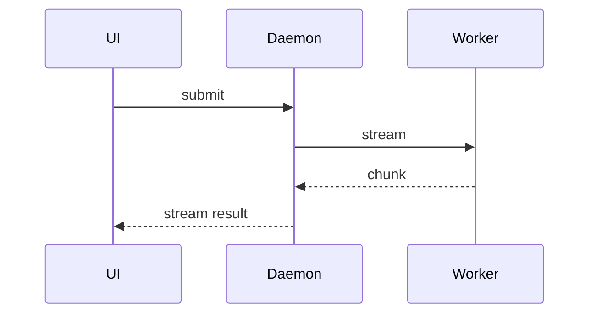

# Write PR Description

Create or update the pull request for the current branch with a description that helps the
reviewer understand why the change exists, the shape of the implementation, and what existing
users lose.

## Workflow

1. Read the PR template:

   `Read(.github/pull_request_template.md)`

2. Identify or create the pull request:
   - Check the current branch for an existing PR: `gh pr view --json url,number,title,state 2>/dev/null`.
   - If no PR exists, inspect `git status --short --branch` and the commits on the current branch.
   - Commit remaining changes, push the branch with an upstream, and create the PR with `gh pr create`.
   - Follow the repository's git safety rules: never commit to `main` directly; work lands through a PR.

3. Gather the context needed to explain the change:
   - Read the linked issue and any relevant task artifacts.
   - Read the complete diff (`git diff main...HEAD`) and enough surrounding code to understand
     behavior and ownership.
   - Use `gh pr view` to collect PR metadata and changed files if the PR already exists.

4. Write the description following the template sections. The body is in English, the PR title
   stays an English Conventional Commit, and changesets stay English (see the `gen-changesets`
   skill); section headings follow the template verbatim:
   - **Related Issue** — one line, or `Resolve #<number>`. Nothing more.
   - **Problem** — the user need or limitation in a sentence or two. Write `See linked issue`
     when the issue already covers it.
   - **What changed** — what you implemented and why the approach fits; prefer visual outline
     views (see below) over prose whenever they explain the change better.
   - **Behavior Changes and Affected Users** — fill the behavior table first, then list affected
     modules and test coverage; see "Behavior Changes and Affected Users".
   - **Checklist** — check every box that applies.

5. Publish the description:
   - Save to a temp file, then `gh pr edit <number> --body-file <path>` or
     `gh pr create --body-file <path>`.
   - Confirm the update succeeded.

## Behavior Changes and Affected Users

This section answers one question: after this merges, what do existing users lose? Most
regressions in this repository came from nobody answering it, not from logic errors.

Criterion: **any input that worked before the change — a config key, an environment variable, a
command-line flag, a provider response shape, session data written by an older version, a client
request, or a hook payload — must behave the same after it, unless the change is declared here
with a way back.**

How to write it:

1. List every observable behavior the diff changes, one row each. Include behavior you consider
   "unchanged" whose branch conditions moved: does a new condition now match existing inputs
   before the old one; who reached a deleted or narrowed branch before. Internal packages ship in
   the CLI release; "internal" does not mean invisible to users. The table shape (example in
   English):

   | Behavior | Before | After | Who relies on the old behavior | Escape hatch |
   |---|---|---|---|---|
   | reasoning parsing when `reasoning_details` is an array | string `reasoning` also read | string ignored | OpenAI-compatible gateways that send both forms | none |

2. Name populations, never "some users". Take them from
   `.agents/skills/review-pr/surfaces.md`: clients (TUI, print mode, desktop, web, inspector,
   VS Code, ACP, SDK), provider dialects, platforms, configuration states, data written by older
   versions, external scripts.

3. Changed prompt text (system prompt, tool descriptions, reminders): one row per sentence — what
   the sentence enforced before, who relied on it, what enforces it now. "No test references the
   sentence" is not evidence of no impact.

4. Replacements and bypasses (refactors, runtime rebinding, protocol swaps): additionally list
   the old path's feature inventory — which env vars it honored, which fallbacks it had, which
   inputs it accepted — and where each item lives in the new path.

5. Genuinely no observable change: write `None`, with evidence — which branches, defaults, and
   contract files are untouched.

6. After the table: affected modules and the test coverage for each row. A flipped default or a
   removed behavior must have a test pinning the old behavior for the population that keeps it,
   and a changeset naming what users lose (see the `gen-changesets` skill). When there is no way
   back, ask a maintainer to approve it explicitly in the PR.

## Visual Outline for What changed

Prefer structural views over prose. Use the smallest combination that explains the
implementation. Omit categories that did not change.

Show logic or algorithm changes as a pseudocode diff:

```diff
  on(save)
-   persist immediately
+   debounce 300ms then persist
+   mark state dirty
```

Show runtime control flow as a call tree diff:

```diff
  submitForm
    validate
    persist
+   trackAnalytics
+   if (subscribed)
+     subscribeToEvents
```

Show file responsibility changes as a shallow file tree diff:

```diff
  src/
    session/
      store.ts
+     selectors.ts
+     stream/
+       parse.ts
```

Show component or UI structure changes as a tree diff:

```diff
  <SessionPage>
    <SessionList />
+   <SessionToolbar />
    <MessageStream />
+   <SkillResultCard />
  </SessionPage>
```

Show component interaction, control flow, or data flow with Mermaid (especially useful for
explaining bug mechanics):



Show key data structure or type changes in a language-specific block:

```ts
interface SessionEvents {
  delta: string;
  done: boolean;
}
```

Rules for visual outlines:
- Use `diff` blocks when the point is what changes and the surrounding shape already exists.
- Show the complete target shape in a language-specific or `text` block when most of it is new or
  diff notation would obscure ownership or order.
- Tell the story in the order that makes it easiest to understand — files first, or data
  structures first, whichever fits.
- Write as one human talking to another: simple, coherent, concise language.
