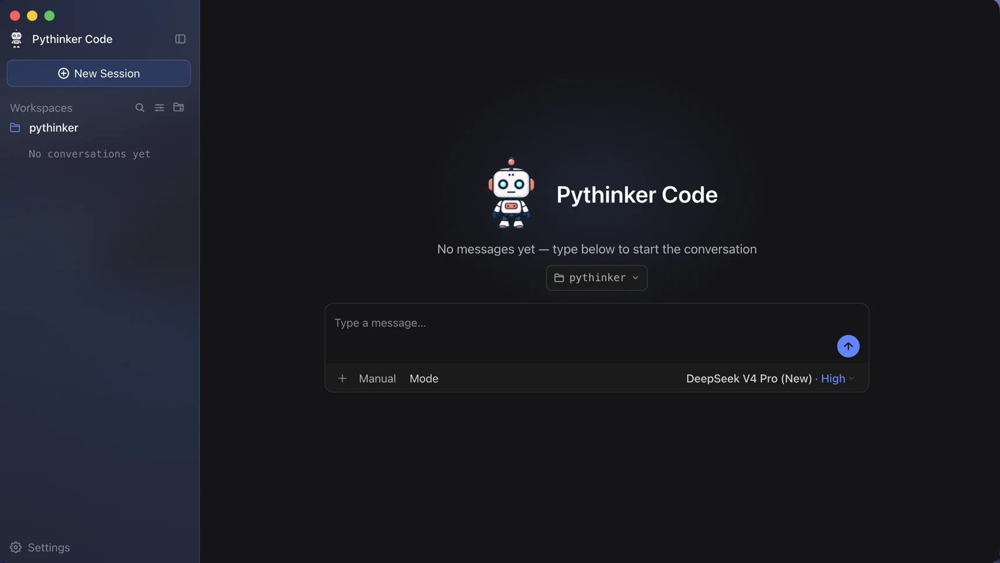
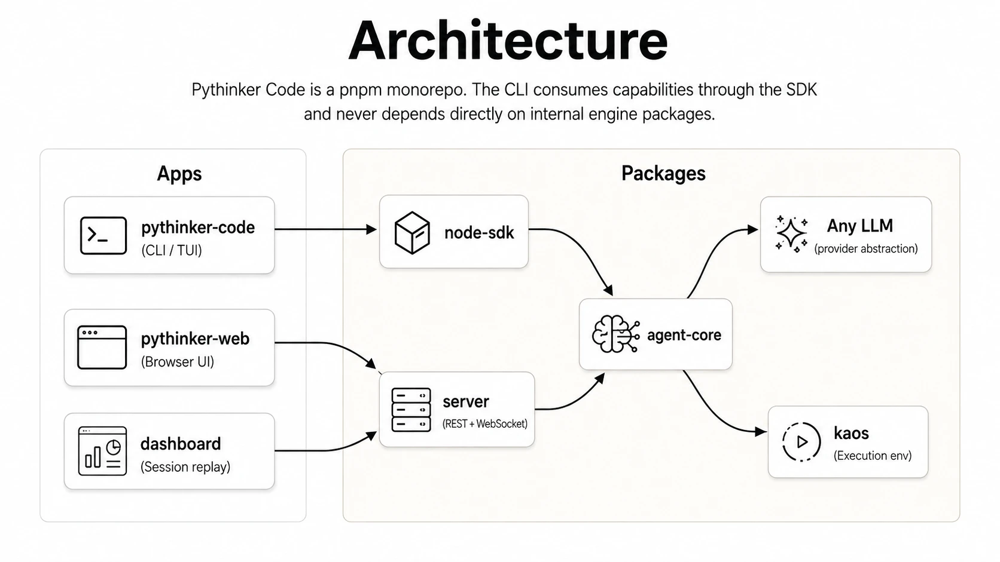

<div align="center">

#  Pythinker Code

### A coding agent you can run as a desktop app

[](https://www.npmjs.com/package/@pymodel/pythinker-code)
[](https://code.pythinker.com/)
[](LICENSE)
[](https://code.pythinker.com/) | [](https://code.pythinker.com/)
[](package.json)
[](https://github.com/PyModel/pythinker-code)

<a href="#get-the-desktop-app">Download</a> &nbsp;·&nbsp;
<a href="#what-the-agent-can-do">Capabilities</a> &nbsp;·&nbsp;
<a href="#in-the-terminal">Terminal</a> &nbsp;·&nbsp;
<a href="#in-your-editor">Editor</a> &nbsp;·&nbsp;
<a href="#development">Development</a>

<br />



</div>

---

## Get the desktop app

**[Download for macOS or Windows](https://code.pythinker.com/)**

Install it, open it, and describe a task. Pythinker then works on your project the way a colleague would: it reads the code, changes files, runs commands, checks what happened, and keeps going until the job is done.

The app runs the whole agent on your machine. It starts a local host bound to loopback, so nothing is exposed to your network. Closing the window hides the app to the tray instead of killing it, so a long session survives.

If you already use the CLI, the app picks up the same data directory (`~/.pythinker-code/` by default). Your login, providers, MCP servers, and past sessions are already there. Updates install themselves, and Settings has a switch if you would rather they did not.

macOS gets a `.dmg`. Windows gets a per-user installer that does not ask for administrator rights. There is no Linux build yet, so on Linux use the terminal version or run `pythinker web` for the browser interface.

More detail is in the [desktop guide](https://pymodel.github.io/pythinker-code/guides/desktop).

---

## What the agent can do

Everything below behaves the same in the app, in the terminal, and in your editor.

### Work on a real codebase

Pythinker searches and reads your repository, edits files, runs shell commands, and reads the output before it decides what to do next. It runs your tests, reads the failures, and tries again. Ask it to refactor a module, trace a bug, or fill in missing tests, and give it as much rope as you are comfortable with.

### Split work across subagents

Large tasks get delegated. A `coder` subagent makes scoped edits, `explore` maps unfamiliar parts of the repo, and `plan` designs the approach. They run in parallel with their own context, so the main conversation stays readable instead of filling with file dumps.

### Keep control of the tools

You see a tool call before it runs, and you approve it. The permission model lets you pre-approve the boring calls and hold the risky ones. Hooks fire on lifecycle events, so you can block a command, record a decision, or trigger something in your own systems.

### Load your own tools and instructions

`/mcp-config` adds and authenticates [Model Context Protocol](https://modelcontextprotocol.io/) servers from inside a session, over stdio or HTTP, and remembers them for next time. Skills are repo-local instruction files that load on demand with `/skill:<name>`. Plugins bundle skills, servers, and data sources from the marketplace or straight from GitHub.

### Use the model you want

Pythinker models work out of the box. Other providers work by configuration, including any OpenAI-compatible endpoint and local ones.

### Show it instead of describing it

Drop a screen recording into the conversation when the bug is easier to show than to write down.

---

## In the terminal

The CLI ships as a native binary, so there is no Node.js prerequisite.

| Platform | Command |
|---|---|
| macOS / Linux | `curl -fsSL https://code.pythinker.com/pythinker-code/install.sh \| bash` |
| Homebrew | `brew install pymodel/tap/pythinker-code` |
| Windows (PowerShell) | `irm https://code.pythinker.com/pythinker-code/install.ps1 \| iex` |
| Nix | `nix run github:PyModel/pythinker-code` |
| npm | `npm install -g @pymodel/pythinker-code` (needs Node.js 24.15+) |

```sh
cd your-project
pythinker
```

Run `/login` on first launch and pick [OAuth](https://pythinker.com/code) or an [API key](https://pythinker.com/code/console). Then ask for something real:

```text
Find where authentication is handled and add a unit test for the token refresh path.
```

> [!NOTE]
> On Windows, install [Git for Windows](https://gitforwindows.org/) first. Pythinker uses the bundled Git Bash as its shell. To point at a different one, set `PYTHINKER_SHELL_PATH` to the full path of `bash.exe`.

<div align="center">

</div>

---

## In your editor

Pythinker speaks the [Agent Client Protocol](https://agentclientprotocol.com/), so Zed, JetBrains, and other ACP editors can host a full session inline. Log in once from the CLI, then point the editor at `pythinker acp`.

<details>
<summary>Zed configuration</summary>

Add to `~/.config/zed/settings.json`:

```json
{
  "agent_servers": {
    "Pythinker Code": {
      "type": "custom",
      "command": "pythinker",
      "args": ["acp"],
      "env": {}
    }
  }
}
```

</details>

[Using in IDEs](https://pymodel.github.io/pythinker-code/guides/ides) covers JetBrains setup and the capability matrix.

<div align="center">

</div>

---

## Documentation

| Topic | Link |
|-------|------|
| Desktop app | [guides/desktop](https://pymodel.github.io/pythinker-code/guides/desktop) |
| Getting started | [guides/getting-started](https://pymodel.github.io/pythinker-code/guides/getting-started) |
| Interaction and approvals | [guides/interaction](https://pymodel.github.io/pythinker-code/guides/interaction) |
| Sessions | [guides/sessions](https://pymodel.github.io/pythinker-code/guides/sessions) |
| Configuration | [configuration/config-files](https://pymodel.github.io/pythinker-code/configuration/config-files) |
| Command reference | [reference/pythinker-command](https://pymodel.github.io/pythinker-code/reference/pythinker-command) |

---

## Development

Pythinker Code is a pnpm monorepo. The desktop app and the CLI both talk to the SDK, never to the engine packages directly.

<p align="center">
  
</p>

| Package | Role |
|---------|------|
| `apps/desktop` | macOS and Windows desktop application |
| `apps/pythinker-code` | CLI and terminal UI |
| `apps/pythinker-web` | Browser interface that the desktop app renders |
| `packages/agent-core` | Agent engine: sessions, tools, skills, permissions, plans |
| `packages/kosong` | LLM and provider abstraction |
| `packages/pyaos` | Execution environment, file and process abstractions |
| `packages/server` | REST and WebSocket session host (`/api/v1`) |
| `packages/node-sdk` | Public TypeScript SDK |

Requirements: Node.js 24.15-24.x, pnpm 10.34.3, Git.

```sh
git clone https://github.com/PyModel/pythinker-code.git
cd pythinker-code
pnpm install

pnpm dev:desktop    # desktop app in dev mode
pnpm dev:cli        # CLI in dev mode
pnpm test           # Vitest
pnpm typecheck      # TypeScript
pnpm lint           # oxlint
pnpm build          # build everything
```

---

## Contributing

Bug reports, PRs, plugins, skills, and docs are all welcome. Start with [`CONTRIBUTING.md`](CONTRIBUTING.md), and read [`SECURITY.md`](SECURITY.md) before reporting a vulnerability.

Open an issue before large refactors or API changes. Use Conventional Commits, add a changeset (`pnpm changeset`) when your PR affects a release artifact, and be ready to explain your diff. AI-assisted PRs are held to the same standard as hand-written ones.

---

## License

MIT. See [`LICENSE`](LICENSE).

Our TUI is built on [`pi-tui`](https://github.com/earendil-works/pi-mono/tree/main/packages/tui). Thanks to its authors.

<div align="center">

[code.pythinker.com](https://code.pythinker.com) &nbsp;·&nbsp;
[Download](https://code.pythinker.com/) &nbsp;·&nbsp;
[npm](https://www.npmjs.com/package/@pymodel/pythinker-code) &nbsp;·&nbsp;
[Docs](https://pymodel.github.io/pythinker-code/)

</div>
