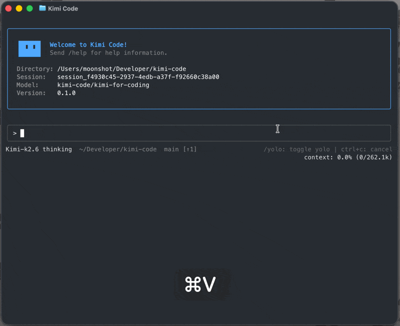

# Pythinker Code CLI

[](LICENSE) [](https://code.pythinker.com/pythinker-code/en/) <br>
[Documentation](https://code.pythinker.com/pythinker-code/en/) · [Issues](https://github.com/PyModel/pythinker-code/issues) · [中文](README.zh-CN.md)



## What is Pythinker Code CLI

Pythinker Code CLI is an AI coding agent that runs in your terminal — it can read and edit code, run shell commands, search files, fetch web pages, and choose the next step based on the feedback it receives. It works out of the box with PyModel’s Pythinker models and can also be configured to use other compatible providers.

## Install

Install with the official script. No Node.js required.

- **macOS or Linux**:

```sh
curl -fsSL https://code.kimi.com/pythinker-code/install.sh | bash
```

- **Windows (PowerShell)**:

```powershell
irm https://code.kimi.com/pythinker-code/install.ps1 | iex
```

> On Windows, install [Git for Windows](https://gitforwindows.org/) before first launch because Pythinker Code CLI uses the bundled Git Bash as its shell environment. If Git Bash is installed in a custom location, set `PYTHINKER_SHELL_PATH` to the absolute path of `bash.exe`.

Then, run it with a new shell session:

```sh
pythinker --version
```

For npm install, upgrade, uninstall, see [Getting Started](https://code.pythinker.com/pythinker-code/en/guides/getting-started).

## Quick Start

Open a project and start the interactive UI:

```sh
cd your-project
pythinker
```

On first launch, run `/login` inside Pythinker Code CLI and choose either Pythinker Code OAuth or a PyModel Open Platform API key. After login, try your first task:

```
Take a look at this project and explain its main directories.
```

## Key Features

- **Single-binary distribution.** Install with one command: no Node.js setup, PATH gymnastics, or global module conflicts.
- **Blazing-fast startup.** The TUI is ready in milliseconds, so starting a session never feels heavy.
- **Purpose-built TUI.** A carefully tuned interface, optimized end to end for long, focused agent sessions.
- **Video input.** Drop a screen recording or demo clip into the chat and let the agent watch what is hard to describe in words — turn a reference clip into a LUT, a long video into a short, a screen recording into working code, and more.
- **AI-native MCP configuration.** Add, edit, and authenticate Model Context Protocol servers conversationally with `/mcp-config`, without hand-editing JSON.
- **Rich plugin ecosystem.** Install skills, MCP servers, and data sources from the marketplace or any GitHub repo, with each install's trust level surfaced up front.
- **Subagents for focused, parallel work.** Dispatch built-in `coder`, `explore`, and `plan` subagents in isolated contexts while keeping the main conversation clean.
- **Lifecycle hooks.** Run local commands at key points to gate risky tool calls, audit decisions, trigger desktop notifications, or connect to your own automation.
- **Editor & IDE integration (ACP).** Drive a Pythinker Code CLI session straight from Zed, JetBrains, or any [Agent Client Protocol](https://agentclientprotocol.com/) client with `pythinker acp`.

## Use it in your editor (ACP)

Pythinker Code CLI speaks the [Agent Client Protocol](https://agentclientprotocol.com/), so ACP-compatible editors and IDEs (Zed, JetBrains, …) can drive a session over stdio. Log in once, then point your editor at the `pythinker acp` subcommand — no extra login needed.

For Zed, add this to `~/.config/zed/settings.json`:

```json
{
  "agent_servers": {
    "Pythinker Code CLI": {
      "type": "custom",
      "command": "pythinker",
      "args": ["acp"],
      "env": {}
    }
  }
}
```

Then open a new conversation in Zed's Agent panel. See [Using in IDEs](https://code.pythinker.com/pythinker-code/en/guides/ides) for JetBrains setup and troubleshooting, and the [`pythinker acp` reference](https://code.pythinker.com/pythinker-code/en/reference/pythinker-acp) for the full capability matrix.

## Docs

- [Getting Started](https://code.pythinker.com/pythinker-code/en/guides/getting-started)
- [Interaction and approvals](https://code.pythinker.com/pythinker-code/en/guides/interaction)
- [Sessions](https://code.pythinker.com/pythinker-code/en/guides/sessions)
- [Using in IDEs (ACP)](https://code.pythinker.com/pythinker-code/en/guides/ides)
- [Configuration](https://code.pythinker.com/pythinker-code/en/configuration/config-files)
- [Command reference](https://code.pythinker.com/pythinker-code/en/reference/pythinker-command)

## Develop

Requirements: Node.js ≥ 24.15.0, pnpm 10.33.0.

```sh
git clone https://github.com/PyModel/pythinker-code.git
cd pythinker-code
pnpm install
```

```sh
pnpm dev:cli    # run the CLI in dev mode
pnpm test       # run tests
pnpm typecheck  # TypeScript check
pnpm lint       # oxlint
pnpm build      # build all packages
```

See [CONTRIBUTING.md](CONTRIBUTING.md) for the full contribution guide.

## Community

- [Issues](https://github.com/PyModel/pythinker-code/issues)
- For security vulnerabilities, see [SECURITY.md](SECURITY.md).

## Acknowledgements

Our TUI is built on top of [`pi-tui`](https://github.com/earendil-works/pi-mono/tree/main/packages/tui). We thank the authors of `pi-tui` for their valuable work.

## License

Released under the [MIT License](LICENSE).
